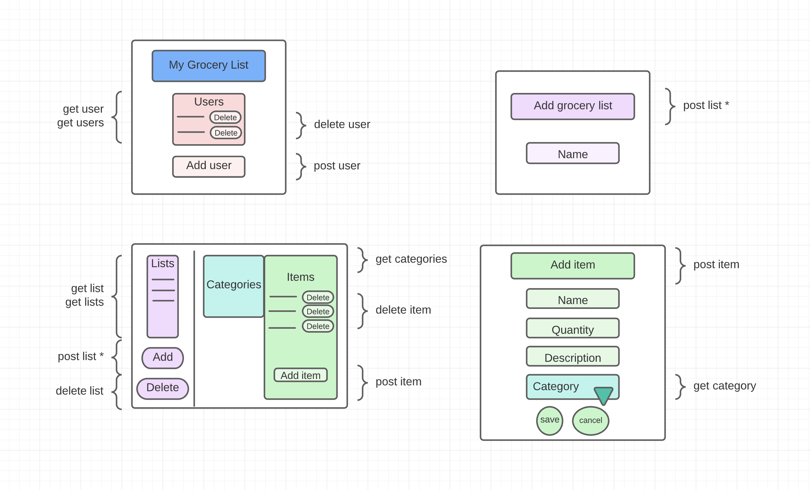
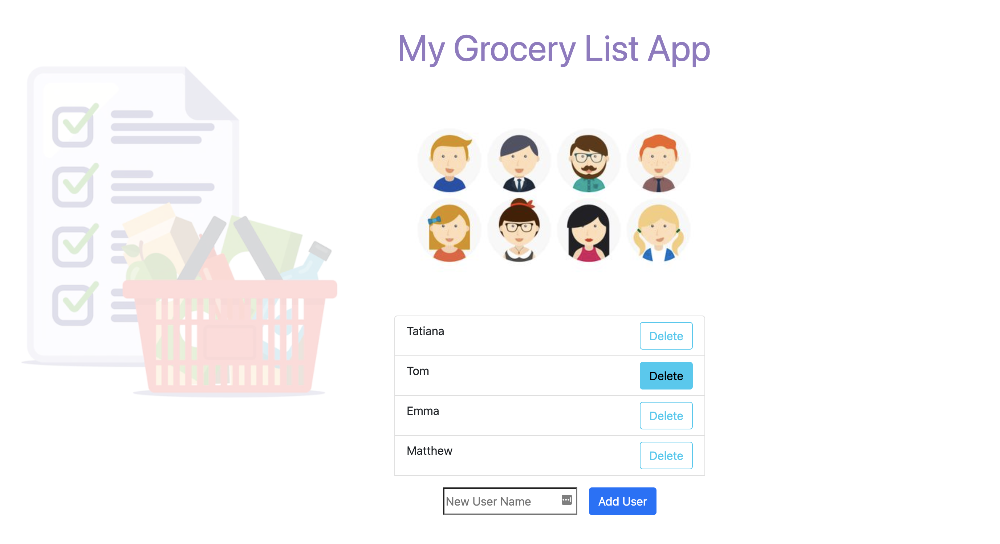
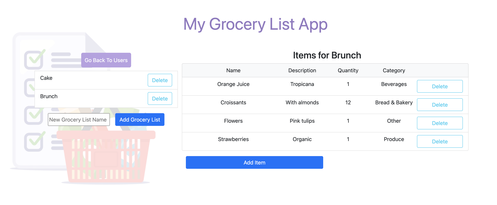
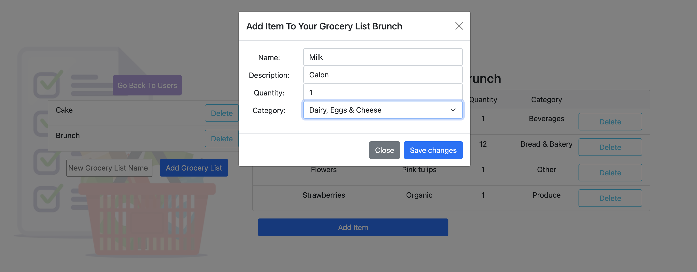

<h1 align="center">
    My-Grocery-List-Frontend
</h1>

    

# Purpose of this application
This application is designed to manage grocery lists. The user should be able to create new lists and manage those lists by adding or deleting items according to purchases needs. The user should be able to view a full list of groceries and categorized each item for better list organization.

# User Stories

As a person I want to be able to manage my grocery purchases using an application
- Given that I want to use an application to manage my groceries
- When I start the application it will ask me for a user name
- Then my name will be recorded in the database as a new user

As a user I want to be able to create a new grocery list.
- Given that I want to create a grocery list
- When I type the new grocery list and send the request to the server
- Then the grocery list is saved in the database and I will see it on my device

As a user I want to be able to create a new item on my grocery list.
- Given that I have an existing grocery list and that I want to create a new item
- When I type the new item on my grocery list and send the request to the server
- Then the item is saved in the database and I will see it on my grocery list

As a user I want to be able to organize items by category on my grocery list.
- Given that I have an existing grocery list and while creating an item
- When I select a category for that item on my grocery list and send the request to the server
- Then the item is saved in the selected category and I will see it on my grocery list

As a user I want to be able to delete an item already purchased.
- Given that I have an existing grocery list
- When I want to delete an item on my grocery list and send the request to the server
- Then the deleted item is removed from the database and I will not see it on my grocery list anymore

As a user I want to be able to see all of my grocery list information.
- Given that I have an existing grocery list
- When I request the grocery list from the server
- Then all the items in the grocery list will be display

As a user I want to be able to delete a grocery list no longer wanted.
- Given that I have an existing grocery list
- When I want to delete that grocery list and send the request to the server
- Then the deleted grocery list is removed from the database and I will not see it on my device anymore

As a user I want to be able to keep as many grocery lists as I want.

# Wireframe

# System Tools Used
- Angular
- Visual Code
- Bootstrap
- Lucidchart

# App Gallery

# Problems encountered
As soon as I tried to connect the frontend with the backend of this project I encountered a CORS error which I solved by creating a proxy. Solution found here: https://angular.io/guide/build#proxying-to-a-backend-server

I created pop-up bootstrap modals to display certain information but it was difficult to make them work as intended. I solved this problem by following the guidance found here: https://stackoverflow.com/questions/62827002/bootstrap-v5-manually-call-a-modal-mymodal-show-not-working-vanilla-javascrip
